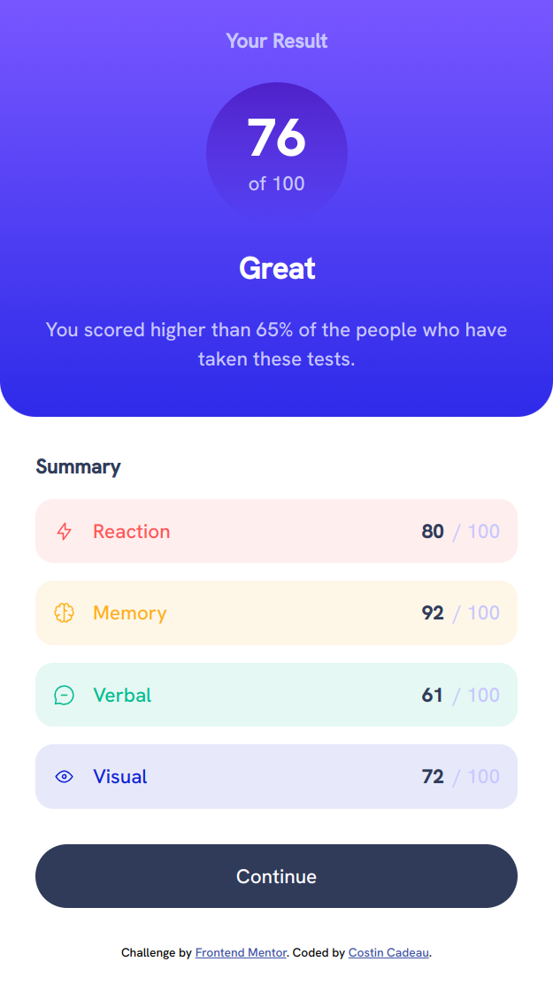
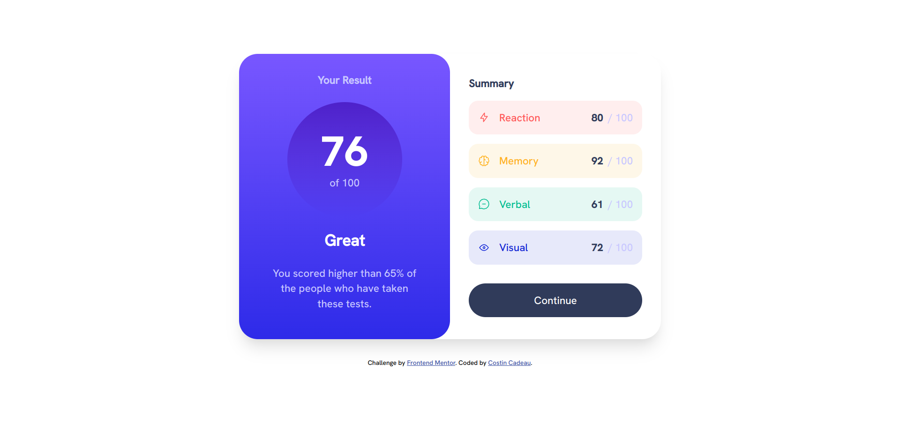

# Frontend Mentor - Results summary component solution

This is a solution to the [Results summary component challenge on Frontend Mentor](https://www.frontendmentor.io/challenges/results-summary-component-CE_K6s0maV). Frontend Mentor challenges help you improve your coding skills by building realistic projects. 

## Table of contents

- [Overview](#overview)
  - [The challenge](#the-challenge)
  - [Screenshot](#screenshot)
  - [Links](#links)
- [My process](#my-process)
  - [Built with](#built-with)
  - [What I learned](#what-i-learned)
  - [Useful resources](#useful-resources)
- [Author](#author)

## Overview

### The challenge

Users should be able to:

- View the optimal layout for the interface depending on their device's screen size
- See hover and focus states for all interactive elements on the page

### Screenshot

#### *Mobile version :*


#### *Desktop version :*


### Links

- Live : [https://c-costin.github.io/results-summary-component/](https://c-costin.github.io/results-summary-component/)
- Repo Github : [https://github.com/c-costin/results-summary-component](https://github.com/c-costin/results-summary-component)

## My process

### Built with

- Semantic HTML5 markup
- Flexbox
- CSS BEM Methodologie
- Mobile-first workflow

### What I learned

I have learned how to use a local font
```css
@font-face {
  font-family: "Name Font";
  src: url("./font.ttf") format("format");
}
```

### Useful resources

- [MDN Web docs](https://developer.mozilla.org/en-US/) - This helped me for use local font.

## Author

- Website - [costincadeau.fr](https://costincadeau.fr)
- Frontend Mentor - [@c-costin](https://www.frontendmentor.io/profile/c-costin)

